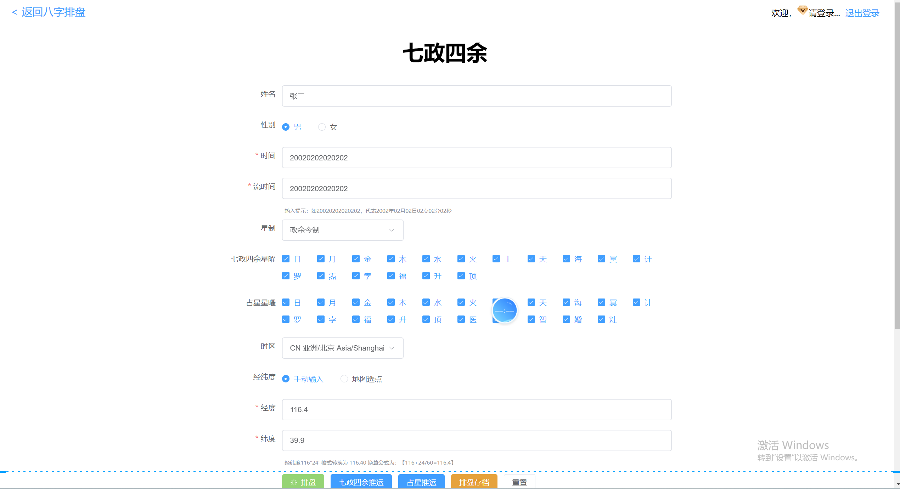
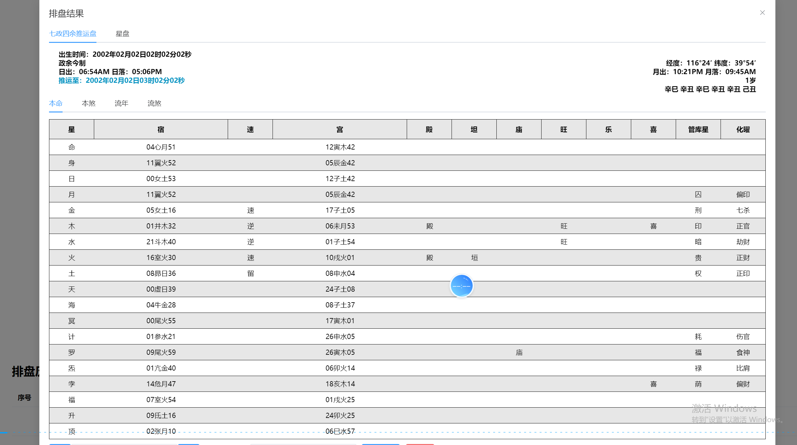
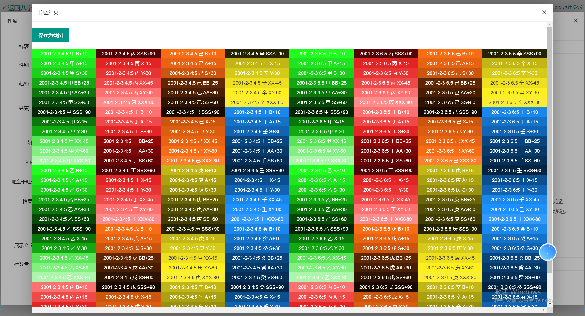

# 周易排盤與八字原始碼 | JavaScript Bazi & Chinese Metaphysics

[簡體中文](README.md) | [繁體中文](README.zh-TW.md) | [English](README.en.md) | [產品網站](https://deeptexas-ai.github.io/Zhouyi-Bagua-Divination-Source-Code/zh-tw/)

這是一個以瀏覽器 JavaScript 為主體的傳統術數排盤原始碼倉庫。公開程式碼涵蓋四柱八字、干支與農曆轉換、十神與神煞、刑沖合害、五行、大運流年、時區與真太陽時相關計算，並包含七政四餘、大六壬及紫微運勢介面呼叫等產品元件。

> 範圍說明：本頁只描述公開程式碼與真實截圖能核實的內容。倉庫沒有 `package.json`、Docker 設定、Python 服務、SQLite 資料庫或完整 64 卦資料，因此不應宣傳為已驗證的一鍵部署或完整三幣六爻系統。部分介面呼叫 `/api`，實際部署前需要補齊對應服務。

## 產品介面

| 四柱八字與大運 | 七政四餘排盤 |
| --- | --- |
|  |  |
| 大六壬盤式 | 五行趨勢與排盤紀錄 |
|  |  |

## 主要功能

### 四柱八字與曆法

- 依公曆時間生成干支、四柱與十神相關資料。
- 公曆與農曆轉換，包含節氣、生肖、儒略日等曆法元件。
- 大運、流年、流月、流日、流時和換運時間展示。
- 支援時區、經緯度及真太陽時相關輸入。

### 五行、十神與神煞

- 天干地支與木、火、土、金、水的映射和生剋關係。
- 十神、藏干以及干支刑、沖、合、害關係。
- `shensha.js` 中的神煞規則、說明和按干支查詢邏輯。
- 五行趨勢參數、圖表及歷史排盤介面。

### 七政四餘、大六壬與擴充元件

- 七政四餘星曜選擇、經緯度、時區與排盤結果介面。
- `kinliuren.js` 提供大六壬盤式計算元件。
- `index.js` 包含紫微運勢圖和反推功能的介面呼叫與圖表渲染程式碼。
- 搜盤、拆補、宮位、九星、八門等篩選項可由截圖介面核實。

## 程式碼結構

| 檔案 | 可核實職責 |
| --- | --- |
| `index.html` / `index.js` | 排盤頁面、輸入流程、圖表和 API 互動 |
| `lunar.js` / `nongli.js` | 公曆、農曆、干支與節氣計算 |
| `paipan.js` | 天文曆法、節氣、真太陽時和排運基礎 |
| `paipan.gx.js` | 十神、藏干、刑沖合害關係 |
| `shensha.js` | 神煞規則、說明與查詢 |
| `kinliuren.js` | 大六壬相關計算 |
| `timezone.js` | 時區、經緯度與偏移資料 |

## 更多真實截圖

| 搜盤條件 | 流年星盤 |
| --- | --- |
|  |  |
| 七政四餘綜合盤 | 星曜組合結果 |
|  |  |

## 使用與部署邊界

公開頁面可以直接閱讀原始檔，但完整執行環境可能依賴倉庫外的樣式、圖表庫和 `/api` 服務。上線前應核對依賴授權、介面實作、資料隱私和計算結果，並補充測試。命理與占卜內容只適合傳統文化研究和娛樂參考，不應取代醫療、法律、投資或其他專業建議。

## 聯絡方式

- Telegram：[@xuzongbin001](https://t.me/xuzongbin001)
- Email：[masterai918@gmail.com](mailto:masterai918@gmail.com)

## License

以倉庫中的 [License.md](License.md) 為準。第三方曆法和演算法程式碼可能保留各自署名及授權要求，商用前請逐項核實。
